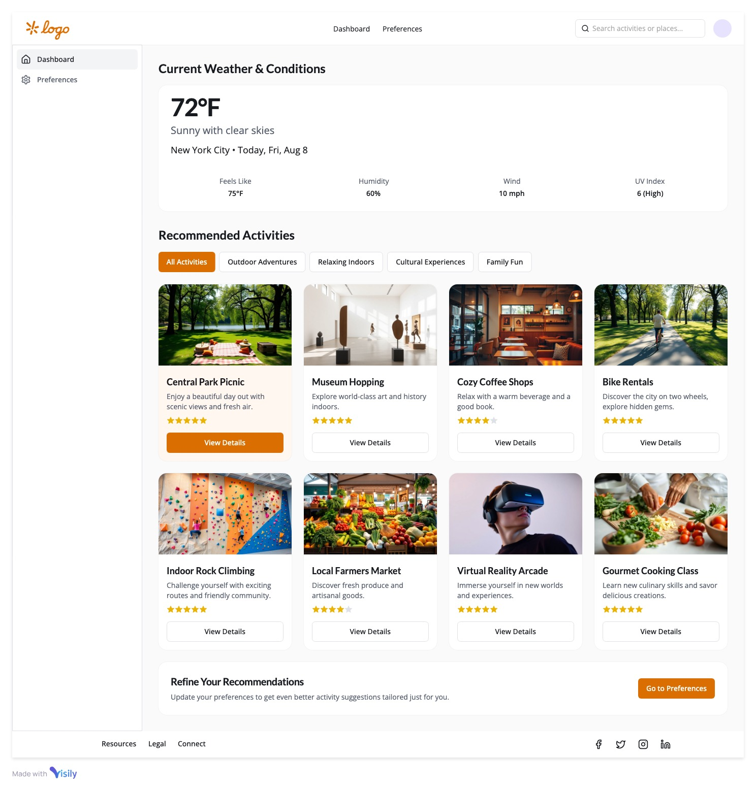

# Navix 🗺️

**Smart Activity Discovery Platform**

Navix is an intelligent activity recommendation system that suggests personalized activities based on your location, weather conditions, and preferences. Discover restaurants, museums, parks, cafes, and more with AI-powered recommendations tailored just for you.



## ✨ Features

### 🎯 **Smart Recommendations**
- **AI-Powered Suggestions**: Uses OpenAI GPT to generate contextual activity recommendations
- **Weather-Aware**: Adapts suggestions based on current weather conditions
- **Location-Based**: Leverages Google Places API for accurate local businesses and attractions
- **Personalized**: Learns from your preferences and activity history

### 🏛️ **Activity Categories**
- **Outdoor Adventures**: Parks, hiking trails, sports activities, gardens
- **Cultural Experiences**: Museums, galleries, theaters, historical sites
- **Relaxing Indoors**: Cafes, spas, libraries, bookstores, cinemas
- **Family Fun**: Restaurants, shopping, entertainment venues, markets

### 📱 **User Experience**
- **Interactive Dashboard**: Clean, modern interface with activity cards
- **Photo Carousels**: Rich visual content with multiple photos per location
- **Real-time Travel Information**: Live travel times and distances for walking and driving
- **Smart Navigation**: Quick access to detailed place information
- **Responsive Design**: Optimized for desktop, tablet, and mobile devices

### 🚗 **Travel Intelligence**
- **Multi-Modal Travel Times**: Real-time walking and driving duration estimates
- **Distance Calculation**: Accurate distance measurements using Google Distance Matrix API
- **Smart Display**: Travel information shown with intuitive icons (🚶 🚗)
- **Route Optimization**: Choose the best transportation method for each activity
- **Location-Aware**: Automatically calculates from your current position

### ⚙️ **Customization**
- **Flexible Preferences**: Enable/disable activity categories
- **Location Settings**: Configurable recommendation radius
- **Unit Preferences**: Celsius/Fahrenheit, Kilometers/Miles
- **Personalization**: Smart filtering based on user behavior

## 🆕 **Latest Updates**

### **v2.1.0 - Travel Intelligence Update**
- ✅ **Real-time Travel Information**: Added travel times and distances for both walking and driving
- ✅ **Enhanced Activity Cards**: Replaced static duration/difficulty with dynamic travel data
- ✅ **Google Distance Matrix Integration**: Live calculations based on user location
- ✅ **Smart Transportation Icons**: Visual indicators for walking 🚶 and driving 🚗 options
- ✅ **Improved User Experience**: Better decision-making with complete travel information

### **Recent Improvements**
- 🔧 **Removed Search Functionality**: Streamlined interface focusing on category-based discovery
- 🔧 **Simplified Interaction**: Removed like/dislike buttons for cleaner card design
- 🎨 **Enhanced Styling**: Better spacing and typography for travel information display
- ⚡ **Performance Optimization**: Efficient API calls with smart caching strategies

## 🛠️ Tech Stack

### **Frontend**
- **React 18** - Modern component-based UI framework
- **React Router** - Client-side routing and navigation
- **Axios** - HTTP client for API communication
- **CSS3** - Advanced styling with gradients, animations, and responsive design
- **Local Storage** - Client-side preference and history management

### **Backend**
- **Django 4** - Python web framework with REST API
- **Django REST Framework** - API serialization and viewsets
- **SQLite** - Lightweight database for development
- **Django Cache** - Performance optimization for API responses

### **External APIs**
- **OpenAI GPT-3.5** - AI-powered activity suggestions
- **Google Maps API** - Places search, photos, location data, and travel calculations
- **Google Distance Matrix API** - Real-time travel times and distances
- **OpenWeatherMap API** - Real-time weather data integration

### **Development Tools**
- **Git** - Version control and collaboration
- **npm** - Frontend package management
- **pip** - Python package management
- **VS Code** - Development environment

## 🚀 Getting Started

### Prerequisites

Before running Navix, ensure you have the following installed:

- **Python 3.8+** (Backend)
- **Node.js 16+** (Frontend)
- **npm** or **yarn** (Package manager)
- **Git** (Version control)

### 📋 Environment Variables

Create a `.env` file in the `backend/` directory with the following variables:

```env
# Required API Keys
OPENAI_API_KEY=your_openai_api_key_here
GOOGLE_MAPS_API_KEY=your_google_maps_api_key_here
OPENWEATHERMAP_API_KEY=your_openweathermap_api_key_here

# Django Settings
SECRET_KEY=your_django_secret_key_here
DEBUG=True

# Database (Optional - defaults to SQLite)
DATABASE_URL=sqlite:///db.sqlite3
```

### 🔑 API Key Setup

#### 1. **OpenAI API Key**
1. Visit [OpenAI Platform](https://platform.openai.com/)
2. Create an account and navigate to API Keys
3. Generate a new API key
4. Add to `.env` as `OPENAI_API_KEY`

#### 2. **Google Maps API Key**
1. Go to [Google Cloud Console](https://console.cloud.google.com/)
2. Create a new project or select existing
3. Enable the following APIs:
   - Places API (for location search and details)
   - Maps JavaScript API (for map integration)
   - Geocoding API (for address conversion)
   - Distance Matrix API (for travel times and distances)
4. Create credentials (API Key)
5. Add to `.env` as `GOOGLE_MAPS_API_KEY`

#### 3. **OpenWeatherMap API Key**
1. Visit [OpenWeatherMap](https://openweathermap.org/api)
2. Sign up for a free account
3. Generate an API key
4. Add to `.env` as `OPENWEATHERMAP_API_KEY`

### 🏃‍♂️ Installation & Setup

#### 1. **Clone the Repository**
```bash
git clone https://github.com/48d31kh413k/new-navix.git
cd new-navix
```

#### 2. **Backend Setup**
```bash
# Navigate to backend directory
cd backend

# Create virtual environment (recommended)
python -m venv venv

# Activate virtual environment
# On macOS/Linux:
source venv/bin/activate
# On Windows:
venv\Scripts\activate

# Install Python dependencies
pip install -r requirements.txt

# Create .env file with your API keys (see above)
touch .env

# Run database migrations
python manage.py migrate

# Start Django development server
python manage.py runserver
```

The backend will be available at: `http://localhost:8000`

#### 3. **Frontend Setup**
```bash
# Open new terminal and navigate to frontend directory
cd frontend

# Install Node.js dependencies
npm install

# Start React development server
npm start
```

The frontend will be available at: `http://localhost:3000`

### 🧪 Testing the Application

1. **Open your browser** to `http://localhost:3000`
2. **Allow location access** when prompted (for location-based recommendations)
3. **Explore the dashboard** to see AI-generated activity suggestions
4. **Customize preferences** in the Settings page
5. **Search and filter** activities using the search bar
6. **View detailed information** by clicking on activity cards

## 📁 Project Structure

```
new-navix/
├── backend/                 # Django REST API
│   ├── api/                # Main API application
│   │   ├── models.py       # Database models
│   │   ├── views.py        # API endpoints and logic
│   │   ├── urls.py         # URL routing
│   │   └── migrations/     # Database migrations
│   ├── navix/              # Django project settings
│   │   ├── settings.py     # Configuration
│   │   └── urls.py         # Main URL routing
│   ├── manage.py           # Django management script
│   └── requirements.txt    # Python dependencies
├── frontend/               # React application
│   ├── public/             # Static assets
│   ├── src/
│   │   ├── components/     # React components
│   │   │   ├── Dashboard.js        # Main activity dashboard
│   │   │   ├── Settings.js         # User preferences
│   │   │   ├── PlaceDetail.js      # Activity details page
│   │   │   ├── PhotoCarousel.js    # Image gallery component
│   │   │   └── *.css              # Component styles
│   │   ├── utils/          # Utility functions
│   │   ├── App.js          # Main application component
│   │   └── index.js        # Application entry point
│   ├── package.json        # Node.js dependencies
│   └── README.md           # Frontend-specific documentation
└── README.md               # This file
```

## 🔧 Configuration

### **Backend Configuration** (`backend/navix/settings.py`)

```python
# CORS settings for frontend integration
CORS_ALLOWED_ORIGINS = [
    "http://localhost:3000",  # React development server
    "http://127.0.0.1:3000",
]

# Cache configuration for API performance
CACHES = {
    'default': {
        'BACKEND': 'django.core.cache.backends.locmem.LocMemCache',
        'TIMEOUT': 3600,  # 1 hour cache
    }
}
```

### **Frontend Configuration** (`frontend/src/`)

The frontend automatically connects to the backend at `http://localhost:8000`. If you need to change this, update the API URLs in the components.

## 🏗️ API Endpoints

### **Activity Suggestions**
- `POST /api/activity-suggestion/` - Get AI-powered activity recommendations with travel times
- `GET /api/suggestions/` - Get weather-based suggestions (legacy)

### **Place Details**
- `GET /api/place-details/{place_id}/` - Get detailed information about a specific place

### **Travel Information**
- **Integrated in activity suggestions** - Travel times and distances calculated automatically
- **Walking & Driving Routes** - Multi-modal transportation options
- **Real-time Calculation** - Live data from Google Distance Matrix API

### **User Preferences**
- `POST /api/user-preference/` - Update user preference (like/dislike)
- `GET /api/user-preferences/` - Get all user preferences
- `DELETE /api/user-preference/{place_id}/` - Delete specific preference

### **System**
- `GET /api/test/` - Health check endpoint

## 🤝 Contributing

1. **Fork the repository**
2. **Create a feature branch**: `git checkout -b feature/amazing-feature`
3. **Commit your changes**: `git commit -m 'Add amazing feature'`
4. **Push to the branch**: `git push origin feature/amazing-feature`
5. **Open a Pull Request**

## 📝 License

This project is licensed under the MIT License - see the [LICENSE](LICENSE) file for details.

## 🆘 Troubleshooting

### **Common Issues**

#### **Backend won't start**
- Ensure all environment variables are set in `.env`
- Check that Python virtual environment is activated
- Verify all dependencies are installed: `pip install -r requirements.txt`

#### **Frontend won't start**
- Clear npm cache: `npm cache clean --force`
- Delete node_modules and reinstall: `rm -rf node_modules && npm install`
- Check Node.js version is 16+

#### **No activity suggestions**
- Verify OpenAI API key is valid and has credits
- Check Google Maps API key has required permissions (Places API, Distance Matrix API)
- Ensure location access is granted in browser

#### **Travel times not displaying**
- Confirm Google Distance Matrix API is enabled in Google Cloud Console
- Check API key quotas and billing settings
- Verify location permissions are granted
- Ensure activities have valid geographic coordinates

#### **Weather data not loading**
- Confirm OpenWeatherMap API key is active
- Check browser console for API errors
- Verify location coordinates are being captured

### **Performance Issues**
- API responses are cached for 1 hour to improve performance
- Large photo carousels may load slowly on slow connections
- Consider reducing `max_places_per_activity` in backend for faster responses

## 🌟 Future Enhancements

- **Mobile App**: React Native implementation
- **Social Features**: Share activities with friends
- **Advanced Filtering**: Price range, distance, rating filters
- **Offline Support**: Cached recommendations for offline use
- **Maps Integration**: Interactive map view of suggested locations
- **Review System**: User-generated reviews and ratings

---

**Made with ❤️ by the Navix Team**

For support or questions, please open an issue on GitHub.